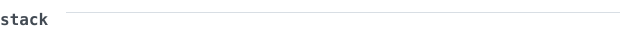
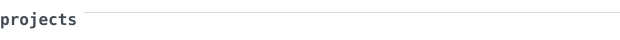
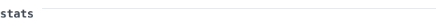

  

  

[nyvo.is-a.dev](https://nyvo.is-a.dev) &nbsp;·&nbsp;
[linkedin](https://www.linkedin.com/in/niek-vogelaar-271222392/) &nbsp;·&nbsp;
[email](mailto:niek@nyvo.is-a.dev)

  

 

<samp>python &nbsp; typescript &nbsp; javascript &nbsp; react &nbsp; html5 &nbsp; css3 &nbsp; vscode &nbsp; git &nbsp; github &nbsp; opencode</samp>

  

 

**[Portfolio](https://github.com/Nyvo2010/Portfolio)** &nbsp;·&nbsp; <samp>typescript, react</samp> 
My personal portfolio website showcasing my projects and skills.

 

**[Butterfly-Agent](https://github.com/Nyvo2010/Butterfly-Agent)** &nbsp;·&nbsp; <samp>typescript</samp> 
Autonomous AI agent for various tasks.

 

**[Alto-AI-Backend](https://github.com/Nyvo2010/Alto-AI-Backend)** &nbsp;·&nbsp; <samp>python</samp> 
AI backend service for intelligent systems.

  

 

 

 

